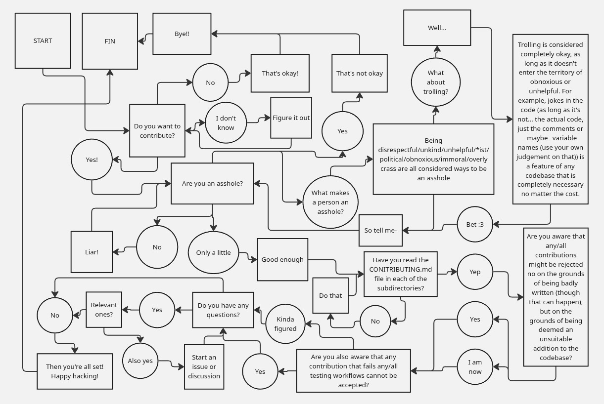

# BERGAMOT

Is a suite of programs designed to monitor events and actions within a system,
and to filter, analyze, and display the data. Currrently, this ecosystem
contains three programs, which operate as follows:

 - "The Allseer": Kernel module that creates events from syscall probes and
   exfiltrates the data through `/proc/all_seer` (currently open, fork,
   connect, and execve families).
 - "The Underseer": Reads said data and sends it to another device
 - "The Overseer": Receives data and displays it on a webpage.

## Building

The Kernel-mode aspect of the ecosystem has to be compiled on the system it is
intended to be running on.

#### PLEASE NOTE

There are various compilation settings that need to be gone through beforehand.
They are in `allseer/switches.h`.

### Compiling For Testing

The configuration of the switches currently reflects the optimal settings for
testing, as that is the only settings in which this program has been run. In a
testing environment, it is assumed that The Overseer will be run on the same
machine as the other two programs, while in a 'production environment' this
would not be the case. The top level `Makefile` has a handy formula for testing
every component of the ecosystem:

```bash
~$ make bergamot_start
```

This compiles the module, builds virtual environments, installs packages in
said virtual environments, and runs everything simultaneously. It also attempts
to load your browser with a webpage running on localhost with a bunch of data
on it, but it doesn't always work and you have to type in the URI yourself.
Pressing CTRL-C won't stop everything; you'll have to run:

```bash
~$ make bergamot_stop
```

and the programs will be killed and them module unloaded. It'll also clean any
compilation files and `__pycache__`s. It will not, however, delete the virtual
environments it created before running the programs that use them.

### Environment Variables

Runtime environment variables can be used to alter network and behavior
settings. Currently, they are as follows:
 - `BERGAMOT_HOST`: The IP of the Ovserseer instance, default is localhost
 - `BERGAMOT_WIRE_PORT`: The port the Overseer receives the wire protocol at,
 default is 12046
 - `BERGAMOT_HTTP_PORT`: The port the Overseer hosts the webpage on, default is
 27960
 - `BERGAMOT_WIRE_HZ`: The frequency of the iterations the Underseer makes when
 reading/sending information, default is 0.25 (Hz)
 - `BERGAMOT_BATCH_MAX`: The maximum amount of syscall entries that can be sent
 via the wire protocol at once

### Compiling For Use

#### TODO

This has never been done before and as a result of that I don't have anything
meaningful to write here.

## CONTRIBUTIONS

Yes.



#### TODO

There's more stuff I should put here but I don't know what.
